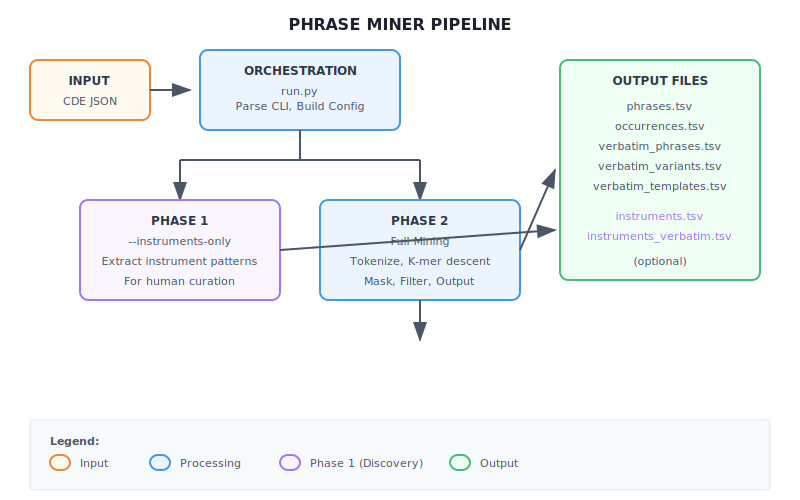
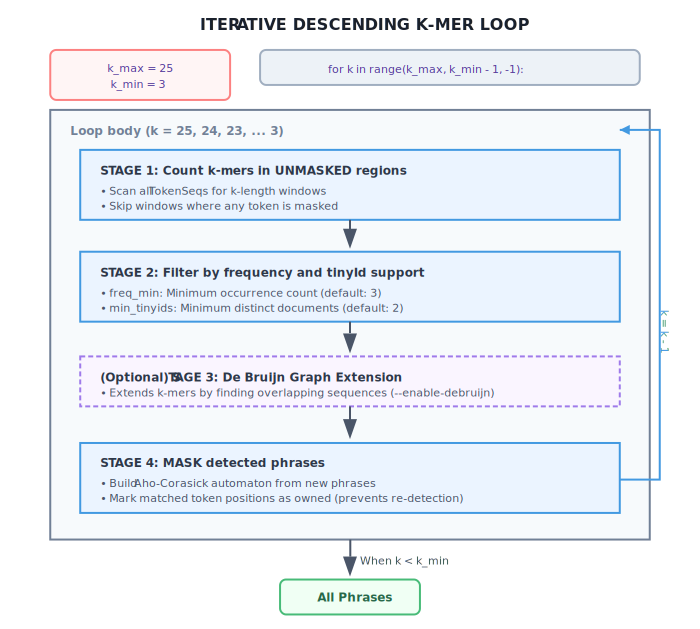
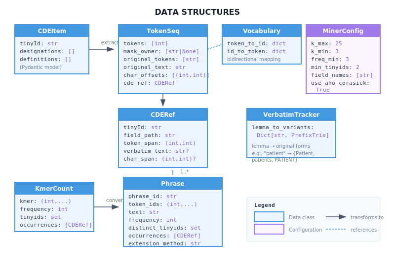
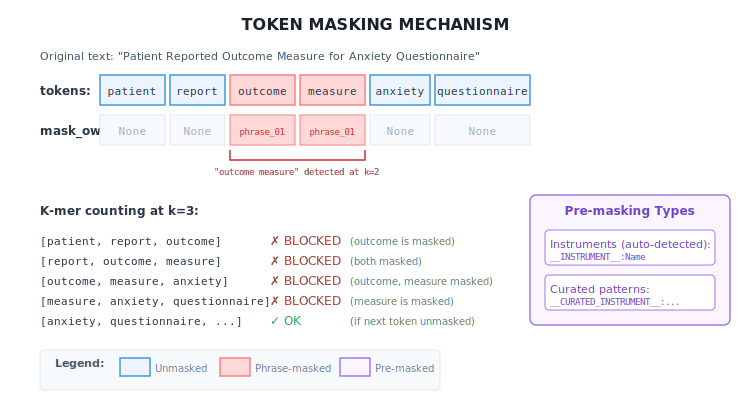
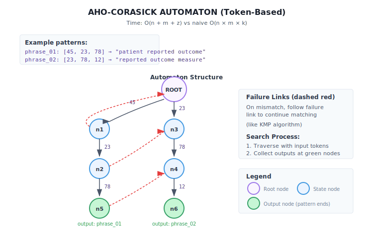
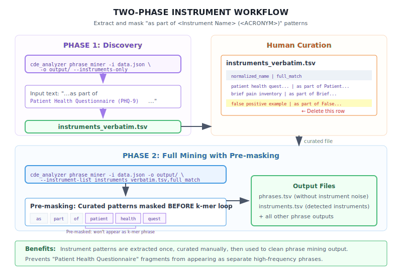
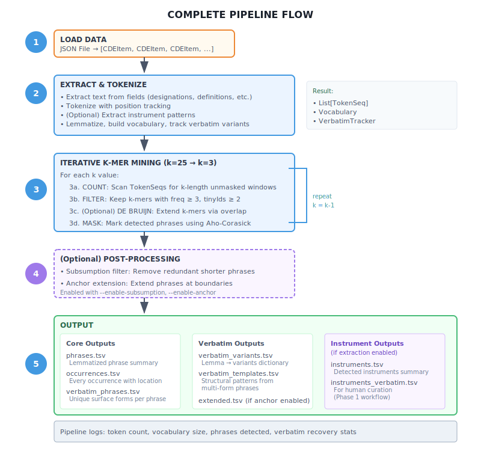

# Phrase Miner Logic

This document describes the internal logic and data flow of the `phrase_miner` action, which implements an iterative descending k-mer algorithm for detecting repeated phrases across CDE (Common Data Element) records.

## High-Level Architecture



The pipeline has two modes:

- **Phase 1** (`--instruments-only`): Lightweight instrument extraction for human curation
- **Phase 2** (default): Full phrase mining with optional pre-masking of curated patterns

## Core Algorithm: Iterative Descending K-mer Mining

The algorithm finds repeated phrases by searching for k-mers (token sequences of length k) starting from long sequences and working down to shorter ones. Detected phrases are "masked" to prevent re-detection at smaller k values.



### Algorithm Steps

1. **Count**: Scan all token sequences for k-length windows in unmasked regions
2. **Filter**: Keep k-mers meeting frequency and document thresholds
3. **Extend** (optional): Use de Bruijn graph to extend k-mers
4. **Mask**: Mark detected phrase positions using Aho-Corasick automaton

## Data Structures

### Core Classes (phrase_miner.py)



| Class         | Purpose                                                 |
| ------------- | ------------------------------------------------------- |
| `CDEItem`     | Input: Pydantic model of CDE record                     |
| `TokenSeq`    | Token sequence with masking state and verbatim tracking |
| `CDERef`      | Reference to source document and field path             |
| `KmerCount`   | K-mer with frequency and occurrence information         |
| `Phrase`      | Detected phrase with metadata                           |
| `Vocabulary`  | Bidirectional token ↔ ID mapping                        |
| `MinerConfig` | Pipeline configuration parameters                       |

### Token Masking Mechanism



`TokenSeq.mask_owner` tracks which phrase "owns" each token position:

- `None` = unmasked (available for k-mer counting)
- `phrase_XXXXX` = owned by detected phrase
- `__INSTRUMENT__:Name` = pre-masked instrument pattern
- `__CURATED_INSTRUMENT__:pattern` = pre-masked curated pattern

## Aho-Corasick Multi-Pattern Matching

Used for efficient phrase masking after each k-bin iteration.



**Complexity**: O(n + m + z) vs naive O(n × m × k) where:

- n = text length (total tokens)
- m = total pattern length
- z = number of matches

## Verbatim Text Recovery

Tracks original surface forms before lemmatization for output.

**Problem**: Lemmatization loses original text

- "Patient Reported Outcomes" → "patient report outcome"
- "patient-reported outcome"  → "patient report outcome" (same lemmas!)

**Solution**: Two-level tracking

1. **Position-based (exact)**: `CDERef.verbatim_text` stores exact text per occurrence
2. **Lemma→Variants dictionary**: `VerbatimTracker` with PrefixTrie for O(k) lookup

## Subsumption Filtering

Optional post-processing to remove redundant shorter phrases (enabled with `--enable-subsumption`).

**Definition**: Phrase P is SUBSUMED by Q if:

1. P's tokens are a contiguous subsequence of Q's tokens
2. P and Q share at least one tinyId (document overlap)

**Example**:

- ✓ `"patient reported outcome measure"` (k=4) - KEPT (longest)
- ✗ `"reported outcome"` (k=2) - REMOVED (subsumed, overlapping tinyIds)
- ✗ `"outcome measure"` (k=2) - REMOVED (subsumed, overlapping tinyIds)
- ✓ `"quality of life"` (k=3) - KEPT (no subsumer)

## Two-Phase Workflow (Instrument Extraction)



### Phase 1: Discovery

```bash
cde-analyzer phrase_miner -i data.json -o output/ --instruments-only
```

Extracts "as part of \<Instrument Name\> (\<ACRONYM\>)" patterns to `instruments_verbatim.tsv` for human curation.

### Phase 2: Full Mining

```bash
cde-analyzer phrase_miner -i data.json -o output/ \
    --instrument-list instruments_verbatim.tsv,full_match
```

Runs full phrase mining with curated patterns pre-masked to prevent instrument fragments from appearing as separate phrases.

## Complete Pipeline Flow



### Pipeline Steps

1. **Load Data**: JSON file → List of CDEItem objects
2. **Extract & Tokenize**:
   - Extract text from specified fields
   - Tokenize with position tracking
   - Lemmatize and build vocabulary
   - Track verbatim variants
   - Pre-mask curated patterns
3. **Iterative K-mer Mining**: k=25 → k=3 with masking
4. **Post-processing** (optional): Subsumption filter, anchor extension
5. **Output**: Write TSV files

## Key Files

| File                                                              | Purpose                       |
| ----------------------------------------------------------------- | ----------------------------- |
| [actions/phrase_miner/cli.py](../actions/phrase_miner/cli.py)     | CLI argument parser           |
| [actions/phrase_miner/run.py](../actions/phrase_miner/run.py)     | Orchestration layer           |
| [logic/phrase_miner.py](../logic/phrase_miner.py)                 | Core mining algorithm         |
| [utils/aho_corasick_token.py](../utils/aho_corasick_token.py)     | Multi-pattern matching        |
| [utils/subsumption_filter.py](../utils/subsumption_filter.py)     | Redundancy removal            |
| [utils/verbatim_tracker.py](../utils/verbatim_tracker.py)         | Original text recovery        |
| [utils/instrument_extractor.py](../utils/instrument_extractor.py) | Instrument pattern extraction |

## Complexity Analysis

| Operation                 | Time Complexity | Notes                           |
| ------------------------- | --------------- | ------------------------------- |
| Tokenization              | O(n)            | n = total characters            |
| K-mer counting (per k)    | O(m × k)        | m = total tokens                |
| Aho-Corasick construction | O(p)            | p = sum of pattern lengths      |
| Aho-Corasick search       | O(m + z)        | z = number of matches           |
| Naive masking             | O(m × s × k)    | s = number of phrases           |
| Subsumption filter        | O(s²)           | Optimized version uses indexing |

Overall pipeline: **O(n + (k_max - k_min) × m × log(s))** where:

- n = total characters in input
- m = total tokens after processing
- s = number of detected phrases
- k_max, k_min = k-mer range (default 25 to 3)
