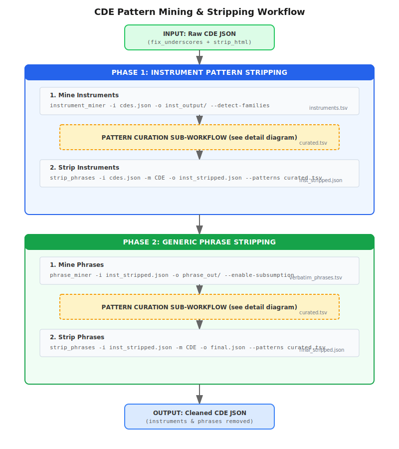
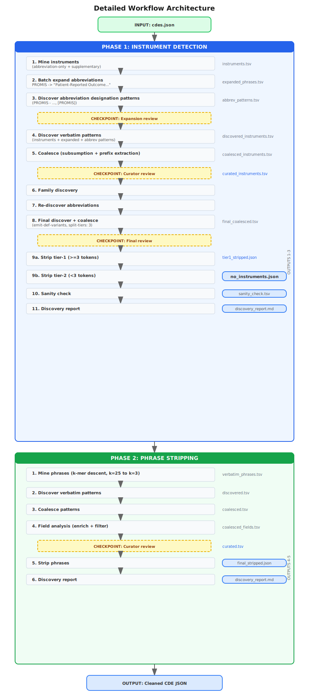
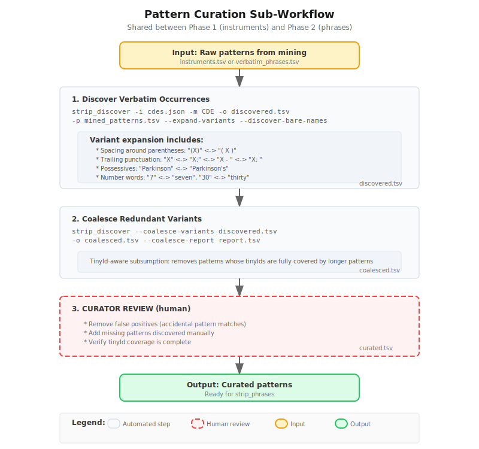
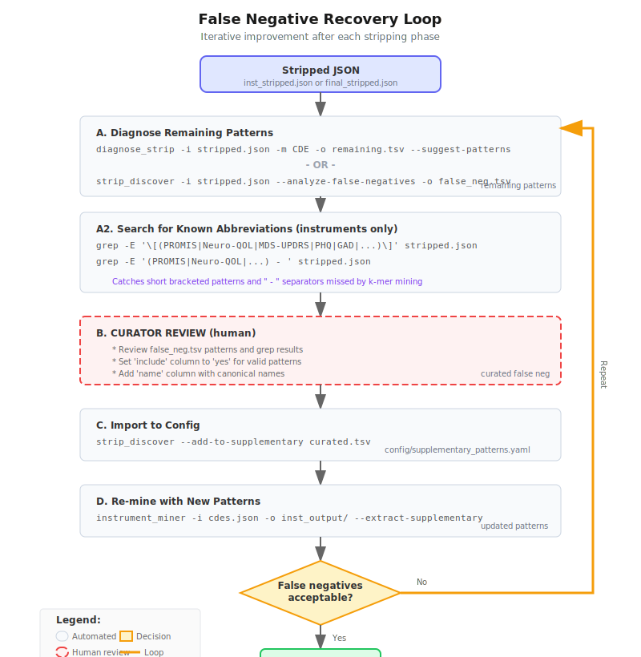

# Workflow Architecture

Two-phase iterative pipeline for extracting and removing repeated patterns from CDE text fields. This document consolidates pipeline diagrams, command references, and design rationale into a single authoritative reference.

For concrete YAML workflow definitions, see:

- [Instrument & Phrase Stripping Workflow](workflows/instrument-phrase-stripping-workflow.md) --- 6-phase conceptual workflow with iterative refinement
- [Instrument Detection Pipeline](workflows/instrument-detection-workflow.md) --- 4-phase, 14-step automated YAML pipeline

---

## Pipeline Overview



The pipeline runs in two major phases, each following the same mine / discover / coalesce / curate / strip pattern. Phase 1 removes instrument names; Phase 2 removes generic repeated phrases from the instrument-stripped output.

---

## Detailed Workflow Architecture



### Phase 1: Instrument Detection (11 steps, 3 checkpoints)

| Step | Action | Output |
|------|--------|--------|
| 1 | Mine instruments (abbreviation-only + supplementary) | `instruments.tsv` |
| 2 | Batch expand abbreviations (PROMIS -> full name) | `expanded_phrases.tsv` |
| 3 | Discover abbreviation designation patterns ([PROMIS], PROMIS - ...) | `abbrev_patterns.tsv` |
| **C1** | **Checkpoint: Expansion review** | |
| 4 | Discover verbatim patterns (instruments + expanded + abbrev) | `discovered_instruments.tsv` |
| 5 | Coalesce (subsumption + prefix extraction) | `coalesced_instruments.tsv` |
| **C2** | **Checkpoint: Curator review** | `curated_instruments.tsv` |
| 6 | Family discovery | |
| 7 | Re-discover abbreviations | |
| 8 | Final discover + coalesce (emit-def-variants, split-tiers: 3) | `final_coalesced.tsv` |
| **C3** | **Checkpoint: Final review** | |
| 9a | Strip tier-1 (>=3 tokens) | `tier1_stripped.json` |
| 9b | Strip tier-2 (<3 tokens) | `no_instruments.json` |
| 10 | Sanity check | `sanity_check.tsv` |
| 11 | Discovery report | `discovery_report.md` |

### Phase 2: Phrase Stripping (6 steps, 1 checkpoint)

| Step | Action | Output |
|------|--------|--------|
| 1 | Mine phrases (k-mer descent, k=25 to k=3) | `verbatim_phrases.tsv` |
| 2 | Discover verbatim patterns | `discovered.tsv` |
| 3 | Coalesce patterns | `coalesced.tsv` |
| 4 | Field analysis (enrich + filter) | `coalesced_fields.tsv` |
| **C4** | **Checkpoint: Curator review** | `curated.tsv` |
| 5 | Strip phrases | `final_stripped.json` |
| 6 | Discovery report | `discovery_report.md` |

### Five Key Outputs

| # | File | Description |
|---|------|-------------|
| 1 | `no_instruments.json` | CDE JSON with instrument names removed |
| 2 | `sanity_check.tsv` | Remaining instrument-like patterns (quality gate) |
| 3 | `phase1_output/discovery_report.md` | Phase 1 pipeline metrics summary |
| 4 | `final_stripped.json` | CDE JSON with both instruments and phrases removed |
| 5 | `phase2_output/discovery_report.md` | Phase 2 pipeline metrics summary |

---

## Pattern Curation Sub-Workflow



This sub-workflow is used in both Phase 1 (instruments) and Phase 2 (phrases). It transforms raw mined patterns into curated patterns ready for stripping:

1. **Discover Verbatim** --- `strip_discover` finds all surface-form occurrences in the source JSON using flexible regex. Variant expansion handles spacing, punctuation, possessives, and number words.

2. **Coalesce Variants** --- `pattern_util --coalesce-variants` performs tinyId-aware subsumption to remove redundant short patterns whose tinyIds are fully covered by longer patterns.

3. **Curator Review** (human) --- Manual review of coalesced patterns. Remove false positives, add missing patterns, verify tinyId coverage.

4. **Output** --- `curated.tsv` ready for `strip_phrases`.

---

## False Negative Recovery Loop



After stripping, some patterns may remain. This iterative loop recovers them:

1. **Diagnose** --- `diagnose_strip` or `strip_discover --analyze-false-negatives` identifies remaining patterns in the stripped output.

2. **Search for Known Abbreviations** (instrument phase only) --- Grep for bracketed patterns `[PROMIS]` and separator patterns `PROMIS - ...` that fall below the k-mer mining threshold.

3. **Curator Review** (human) --- Review false negative candidates. Mark valid patterns for inclusion.

4. **Import to Config** --- `pattern_util --harvest-to-supplementary` adds curated false negatives to `config/supplementary_patterns.yaml`.

5. **Re-mine** --- `instrument_miner --extract-supplementary` picks up newly added patterns.

6. **Repeat** until false negatives are acceptable.

---

## Two-Pass Stripping

The instrument pipeline strips in two passes to prevent short fragment patterns from damaging longer instrument names:

1. **Tier-1** (>=3 tokens): Long instrument patterns stripped first (e.g., "Geriatric Depression Scale (GDS)")
2. **Tier-2** (<3 tokens): Short fragments stripped from tier-1 output (e.g., "Scale", "GDS")

This is controlled by `--split-tiers 3` on `pattern_util --coalesce-variants` and sequential `strip_tier1`/`strip_tier2` workflow steps.

---

## Command Quick Reference

### Phase 1: Instrument Mining & Stripping

```bash
# 1. Mine instruments
cde-analyzer instrument_miner -i cdes.json -o inst_output/ \
    --detect-families --family-summary

# 1b. Discover abbreviation-based patterns
cde-analyzer strip_discover --discover-abbreviations inst_output/instruments.tsv \
    -i cdes.json -o inst_output/abbrev_patterns.tsv

# 2. Discover verbatim occurrences with variants
cde-analyzer strip_discover -i cdes.json -m CDE \
    -o discovered_inst.tsv -p inst_output/instruments.tsv \
    --additional-patterns inst_output/abbrev_patterns.tsv \
    --expand-variants --discover-bare-names

# 3. Coalesce redundant variants
cde-analyzer pattern_util --coalesce-variants discovered_inst.tsv \
    -o coalesced_inst.tsv --coalesce-report coalesce_report.tsv

# 4. [CURATOR REVIEW: edit coalesced_inst.tsv]

# 5. Strip instruments from CDE JSON
cde-analyzer strip_phrases -i cdes.json -m CDE \
    -o inst_stripped.json --patterns coalesced_inst.tsv
```

### Phase 2: Generic Phrase Mining & Stripping

```bash
# 1. Mine phrases from instrument-stripped data
cde-analyzer phrase_miner -i inst_stripped.json -o phrase_output/ \
    --enable-subsumption --analyze-phrase-families

# 2. Discover verbatim occurrences with variants
cde-analyzer strip_discover -i inst_stripped.json -m CDE \
    -o discovered_phrases.tsv -p phrase_output/verbatim_phrases.tsv \
    --expand-variants

# 3. Coalesce redundant variants
cde-analyzer pattern_util --coalesce-variants discovered_phrases.tsv \
    -o coalesced_phrases.tsv --coalesce-report phrase_coalesce.tsv

# 4. [CURATOR REVIEW: edit coalesced_phrases.tsv]

# 5. Strip phrases from CDE JSON
cde-analyzer strip_phrases -i inst_stripped.json -m CDE \
    -o final_stripped.json --patterns coalesced_phrases.tsv
```

### False Negative Recovery

```bash
# A. Diagnose remaining patterns
cde-analyzer diagnose_strip -i final_stripped.json -m CDE \
    -o remaining.tsv --suggest-patterns

# B. [CURATOR REVIEW: combine results, mark valid patterns]

# C. Import to supplementary config
cde-analyzer pattern_util --harvest-to-supplementary curated_fn.tsv

# D. Re-mine with supplementary patterns
cde-analyzer instrument_miner -i cdes.json -o inst_output/ \
    --extract-supplementary
```

---

## Key Files in Workflow

| Stage | Input | Output | Description |
|-------|-------|--------|-------------|
| Preprocessing | raw.json | cdes.json | fix_underscores + strip_html |
| Instrument Mine | cdes.json | instruments.tsv | Raw instrument patterns |
| Discover (inst) | instruments.tsv | discovered_inst.tsv | Verbatim with variants |
| Coalesce (inst) | discovered_inst.tsv | coalesced_inst.tsv | Deduplicated patterns |
| Strip (inst) | cdes.json + patterns | inst_stripped.json | Instrument-free JSON |
| Phrase Mine | inst_stripped.json | verbatim_phrases.tsv | Raw phrase patterns |
| Discover (phrase) | verbatim_phrases.tsv | discovered_phrases.tsv | Verbatim with variants |
| Coalesce (phrase) | discovered_phrases.tsv | coalesced_phrases.tsv | Deduplicated patterns |
| Strip (phrase) | inst_stripped.json + patterns | final_stripped.json | Fully cleaned JSON |

---

## Design Rationale

- **Why two phases?** Instruments ("as part of X") are domain-specific noise that obscures general phrases. Removing them first reveals underlying patterns.

- **Why expand then coalesce?** Expansion catches all surface-form variants (punctuation, spacing, numbers). Coalescing removes redundant short patterns covered by longer ones, reducing curator review burden.

- **Why curator review?** Automated mining includes false positives (accidental patterns). Human review ensures only meaningful patterns are stripped.

- **Why two-pass stripping?** Short fragment patterns like "Scale" or "past" can match inside longer instrument names, destroying them before the longer pattern can match. Tier-1 (long) then tier-2 (short) prevents this damage.

- **Iterative improvement**: After each strip phase, remaining patterns can be recovered and added to supplementary config for the next round.

- **Why search for abbreviations?** K-mer mining has a minimum length threshold, so short patterns like `[PROMIS]` or `[Neuro-QOL]` may be missed. Grepping for known abbreviations catches these edge cases.

---

## Related Documentation

- [Instrument & Phrase Stripping Workflow](workflows/instrument-phrase-stripping-workflow.md) --- 6-phase conceptual workflow
- [Instrument Detection Pipeline](workflows/instrument-detection-workflow.md) --- Automated YAML pipeline
- [Curation Guide](curation-guide.md) --- Decision guidelines for pattern review
- [Phrase Miner Logic](phrase_miner_logic.md) --- Algorithm internals
- [Architecture](architecture.md) --- Code-level design
