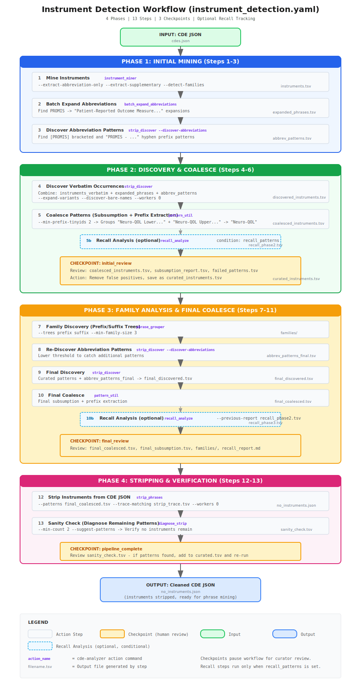

# Instrument Detection Workflow

This document describes the **automated instrument detection workflow** implemented in `workflows/instrument_detection.yaml`. This is a concrete instantiation of the conceptual [Instrument & Phrase Stripping Workflow](instrument-phrase-stripping-workflow.md), automated through the YAML workflow orchestrator.



## Overview

The `instrument_detection` workflow is a 4-phase, 14-step pipeline that automatically discovers, expands, coalesces, and strips medical instrument patterns from CDE text fields. It includes three human review checkpoints for curator validation.

| Phase | Steps | Purpose | Checkpoint |
|-------|-------|---------|------------|
| 1 | 1-3 | Initial Mining | Optional |
| 2 | 4-6 | Discovery, Coalesce & Recall | **Yes** - initial_review |
| 3 | 7-11 | Family Analysis, Final Coalesce & Recall | **Yes** - final_review |
| 4 | 12-13 | Stripping & Verification | **Yes** - pipeline_complete |

**Recall Tracking**: When `recall_patterns` is set, conditional recall analysis steps run after each coalesce phase, generating a markdown report with per-family recall and iteration gains.

---

## Quick Start

```bash
# 1. Copy template to working directory
cde-analyzer workflow copy instrument_detection

# 2. Edit the copied file to set your input/output paths
#    (or use --set overrides at runtime)

# 3. Run the workflow
cde-analyzer workflow run ./instrument_detection.yaml \
    --set input_json=/path/to/cdes.json \
    --set output_dir=./phase1_output

# 4. At checkpoints, review files and resume
cde-analyzer workflow resume --state-file ./phase1_output/.workflow_state.json
```

---

## Phase 1: Initial Mining (Steps 1-3)

### Purpose
Extract instrument patterns from CDE text using multiple strategies:
1. Mine instruments from "as part of" anchor patterns
2. Expand abbreviations to discover extended phrases
3. Discover abbreviation-based designation patterns

### Step 1: Mine Instruments

**Action**: `instrument_miner`

```yaml
- name: mine_instruments
  action: instrument_miner
  args:
    input: "${input_json}"
    output_dir: "${output_dir}/"
    extract_abbreviation_only: true
    extract_supplementary: true
    detect_families: true
    family_summary: true
```

**Outputs**:
- `instruments.tsv` - All detected instruments with family assignments and abbreviations
- `instruments_verbatim.tsv` - Verbatim surface forms (full_match column)
- `instrument_families.tsv` - Summary by instrument family

**Key Features**:
- Extracts patterns using "as part of {instrument}" anchor
- Detects abbreviations (acronyms in parentheses)
- Assigns family IDs based on pattern matching
- Includes supplementary patterns from `config/supplementary_patterns.yaml`

### Step 2: Batch Expand Abbreviations

**Action**: `batch_expand_abbreviations`

```yaml
- name: expand_abbreviations
  action: batch_expand_abbreviations
  args:
    input: "${input_json}"
    abbreviations: "${instruments_tsv}"
    acronym_column: "acronym"
    output_dir: "${expansions_dir}"
    fields:
      - designation
      - definition
    k_max: 15
    k_min: 3
    min_tinyids: 2
    top_phrases: 10
    min_subset_size: 3
```

**Purpose**: Expand abbreviations (e.g., PROMIS, NHANES) to discover full forms that may appear in text without the abbreviation.

**Outputs** (in `${expansions_dir}/`):
- `expanded_phrases.tsv` - Discovered expanded phrases
- `expansion_summary.tsv` - Per-abbreviation status
- Individual `{acronym}_phrases.tsv` files

### Step 3: Discover Abbreviation Patterns

**Action**: `strip_discover` (abbreviation mode)

```yaml
- name: discover_abbreviations
  action: strip_discover
  args:
    discover_abbreviations: "${instruments_tsv}"
    input: "${input_json}"
    output: "${abbrev_patterns}"
    min_pattern_tinyids: 2
```

**Purpose**: Find designation patterns that use abbreviations in specific formats that k-mer mining misses:
- **Bracketed suffix**: `[PROMIS]`, `[NHANES]`
- **Hyphen prefix**: `PROMIS - Pain Interference`, `Neuro-QOL - Anxiety`

**Output**: `abbrev_patterns.tsv` with pattern, count, tinyIds columns

### Optional: Expansion Review Checkpoint

The standard template includes a checkpoint after Phase 1 for reviewing expansion results:

```yaml
- name: expansion_review
  checkpoint: true
  message: |
    PHASE 1 COMPLETE: Review abbreviation expansion and designation patterns.

    Files to review:
      - ${expansions_dir}/expanded_phrases.tsv
      - ${abbrev_patterns}
      - ${instruments_verbatim}
```

---

## Phase 2: Discovery & Coalesce (Steps 4-6)

### Purpose
Combine all pattern sources, discover verbatim occurrences, and coalesce patterns using subsumption analysis and prefix extraction.

### Step 4: Discover Verbatim Occurrences

**Action**: `strip_discover` (discovery mode)

```yaml
- name: discover_verbatim
  action: strip_discover
  args:
    input: "${input_json}"
    model: CDE
    output: "${discovered_tsv}"
    pattern_list: "${instruments_verbatim},full_match,tinyids"
    additional_patterns:
      - "${expanded_phrases},expanded_phrase"
      - "${abbrev_patterns},pattern"
    expand_variants: true
    discover_bare_names: true
    discover_fails: "${failed_patterns}"
    workers: "${workers}"
```

**Key Features**:
- **Pattern Sources**: Combines three TSV files:
  - `instruments_verbatim.tsv` - Base instrument patterns
  - `expanded_phrases.tsv` - Abbreviation expansions
  - `abbrev_patterns.tsv` - Abbreviation designation patterns
- **Variant Expansion**: Generates spelling/punctuation variants
- **Bare Name Discovery**: Second pass for instrument names without "as part of"
- **Parallel Processing**: Auto-detected worker count

**Output**: `discovered_instruments.tsv` with verbatim patterns found in CDE text

### Step 5: Coalesce Patterns

**Action**: `strip_discover` (coalesce mode)

```yaml
- name: coalesce_patterns
  action: strip_discover
  args:
    coalesce_variants: "${discovered_tsv}"
    output: "${coalesced_tsv}"
    coalesce_report: "${coalesce_report}"
    min_prefix_tinyids: 2
```

**Key Features**:
- **Subsumption Analysis**: Removes patterns that are substrings of others (when tinyIds overlap)
- **Prefix Extraction**: Groups patterns by common prefix and replaces with shorter pattern

**Prefix Extraction Example**:
```
Input patterns:
  - "as part of Neuro-QOL Lower Extremity Function" (15 tinyIds)
  - "as part of Neuro-QOL Upper Extremity Function" (12 tinyIds)
  - "as part of Neuro-QOL Anxiety" (8 tinyIds)

Output with min_prefix_tinyids=2:
  - "as part of Neuro-QOL" (35 tinyIds, union of above)
```

**Outputs**:
- `coalesced_instruments.tsv` - Reduced pattern set
- `subsumption_report.tsv` - Details of which patterns were subsumed or coalesced

### Step 5b: Recall Analysis (Optional)

**Action**: `recall_analyze` (conditional on `recall_patterns`)

```yaml
- name: recall_phase2
  action: recall_analyze
  condition: "${recall_patterns}"
  args:
    input: "${input_json}"
    model: CDE
    pattern_file: "${recall_patterns}"
    pipeline_output: "${coalesced_tsv}"
    pipeline_tinyid_column: "${recall_tinyid_column}"
    output: "${recall_phase2_tsv}"
    markdown_report: "${recall_report_md}"
    markdown_detail: "${recall_phase2_md}"
    report_version: "phase-2-coalesced"
    min_recall: 0.7
```

**Purpose**: Compare pipeline output against ground truth patterns to measure recall. Only runs when `recall_patterns` variable is set. Generates a markdown report with per-family recall breakdown.

### Step 6: Initial Review Checkpoint

```yaml
- name: initial_review
  checkpoint: true
  message: |
    PHASE 2 COMPLETE: Initial instrument pattern curation required.

    Files to review:
      - ${coalesced_tsv} (discovered patterns after subsumption)
      - ${coalesce_report} (subsumption details)
      - ${failed_patterns} (patterns that didn't match)
      - ${abbrev_patterns} (abbreviation-based designation patterns)

    Actions:
      1. Open ${coalesced_tsv} in spreadsheet
      2. Remove false positives (accidental matches)
      3. Verify expanded phrases are correct instrument names
      4. Check ${failed_patterns} for patterns that should have matched
      5. Save reviewed version as ${curated_tsv}
```

**Curator Actions**:
1. Review `coalesced_instruments.tsv` for false positives
2. Review `subsumption_report.tsv` to verify correct coalescing
3. Check `failed_patterns.tsv` for patterns that should have matched
4. Save curated version as `curated_instruments.tsv`

---

## Phase 3: Family Analysis & Final Coalesce (Steps 7-11)

### Purpose
Analyze phrase families, re-discover patterns with curated list, and perform final coalescing.

### Step 7: Family Discovery

**Action**: `phrase_grouper`

```yaml
- name: family_discovery
  action: phrase_grouper
  args:
    input: "${curated_tsv}"
    output_dir: "${families_dir}"
    text_column: "pattern"
    tinyid_column: "tinyids"
    min_family_size: 3
    trees:
      - prefix
      - suffix
```

**Purpose**: Analyze patterns for family structure using prefix/suffix trees.

**Outputs** (in `${families_dir}/`):
- `prefix_families.tsv` - Patterns grouped by shared prefix
- `suffix_families.tsv` - Patterns grouped by shared suffix
- `phrase_assignments.tsv` - Which family each phrase belongs to

### Step 8: Re-discover Abbreviation Patterns

**Action**: `strip_discover` (abbreviation mode)

```yaml
- name: discover_abbreviations_final
  action: strip_discover
  args:
    discover_abbreviations: "${instruments_tsv}"
    input: "${input_json}"
    output: "${output_dir}/abbrev_patterns_final.tsv"
    min_pattern_tinyids: 2
```

**Purpose**: Re-scan with lower threshold to catch additional abbreviation patterns.

### Step 9: Final Discovery

**Action**: `strip_discover` (discovery mode)

```yaml
- name: final_discover
  action: strip_discover
  args:
    input: "${input_json}"
    model: CDE
    output: "${final_discovered}"
    pattern_list: "${curated_tsv},pattern,tinyids"
    additional_patterns:
      - "${output_dir}/abbrev_patterns_final.tsv,pattern"
    expand_variants: true
    sort_order: length
    workers: "${workers}"
```

**Purpose**: Re-discover using curated patterns plus new abbreviation patterns.

### Step 10: Final Coalesce

**Action**: `strip_discover` (coalesce mode)

```yaml
- name: final_coalesce
  action: strip_discover
  args:
    coalesce_variants: "${final_discovered}"
    output: "${final_coalesced}"
    coalesce_report: "${final_subsumption}"
    min_prefix_tinyids: 2
```

**Purpose**: Final subsumption and prefix extraction.

### Step 10b: Recall Analysis (Optional)

**Action**: `recall_analyze` (conditional on `recall_patterns`)

```yaml
- name: recall_phase3
  action: recall_analyze
  condition: "${recall_patterns}"
  args:
    input: "${input_json}"
    model: CDE
    pattern_file: "${recall_patterns}"
    pipeline_output: "${final_coalesced}"
    pipeline_tinyid_column: "${recall_tinyid_column}"
    output: "${recall_phase3_tsv}"
    markdown_report: "${recall_report_md}"
    markdown_detail: "${recall_phase3_md}"
    report_version: "phase-3-final"
    previous_report: "${recall_phase2_tsv}"
    min_recall: 0.8
```

**Purpose**: Compare Phase 3 recall against Phase 2 baseline using `--previous-report`. Reports iteration gains and flags diminishing returns. The recall report markdown (`recall_report.md`) accumulates version history across phases.

### Step 11: Final Review Checkpoint

```yaml
- name: final_review
  checkpoint: true
  message: |
    PHASE 3 COMPLETE: Final instrument pattern review before stripping.

    Files to review:
      - ${final_coalesced} (final patterns to strip)
      - ${final_subsumption} (subsumption analysis)
      - ${output_dir}/abbrev_patterns_final.tsv (Phase 3 abbreviation patterns)
      - ${families_dir}/ (family assignments)
```

---

## Phase 4: Stripping & Verification (Steps 12-13)

### Purpose
Apply final stripping and verify completeness.

### Step 12: Strip Instruments

**Action**: `strip_phrases`

```yaml
- name: strip_instruments
  action: strip_phrases
  args:
    input: "${input_json}"
    model: CDE
    output: "${stripped_json}"
    patterns: "${final_coalesced},pattern"
    trace_matching: "${trace_tsv}"
    workers: "${workers}"
```

**Purpose**: Remove all discovered instrument patterns from CDE text.

**Outputs**:
- `no_instruments.json` - CDE data with instruments stripped
- `strip_trace.tsv` - Detailed matching trace

### Step 13: Sanity Check

**Action**: `diagnose_strip`

```yaml
- name: sanity_check
  action: diagnose_strip
  args:
    input: "${stripped_json}"
    model: CDE
    output: "${sanity_check}"
    min_count: 2
    suggest_patterns: true
```

**Purpose**: Verify no instruments remain. Diagnose any remaining "as part of" patterns.

**Output**: `sanity_check.tsv` with remaining anchor patterns (if any)

### Pipeline Complete Checkpoint

```yaml
- name: pipeline_complete
  checkpoint: true
  message: |
    INSTRUMENT DETECTION PIPELINE COMPLETE!

    Outputs:
      - ${stripped_json} (CDE JSON with instruments stripped)
      - ${trace_tsv} (detailed matching trace)
      - ${families_dir}/ (instrument family analysis)

    Quality Assurance:
      - ${sanity_check} shows remaining "as part of" patterns
      - If patterns found with count >= 2, consider adding to curated.tsv
```

---

## Workflow Variables

### Primary Variables

| Variable | Default | Description |
|----------|---------|-------------|
| `input_json` | `${CDE_INPUT:-cdes.json}` | Input CDE JSON file |
| `output_dir` | `${OUTPUT_DIR:-./phase1_output}` | Output directory |
| `workers` | `0` (auto-detect) | Parallel worker count |
| `recall_patterns` | *(empty)* | Ground truth pattern file for recall tracking. When set, enables conditional `recall_phase2` and `recall_phase3` steps. |
| `recall_tinyid_column` | `tinyids` | Column name for tinyIds in recall pattern file |

### Derived Variables

All intermediate files are derived from `output_dir`:

| Variable | Path | Description |
|----------|------|-------------|
| `instruments_tsv` | `${output_dir}/instruments.tsv` | Mined instruments |
| `instruments_verbatim` | `${output_dir}/instruments_verbatim.tsv` | Verbatim forms |
| `expansions_dir` | `${output_dir}/abbreviation_expansions` | Expansion outputs |
| `expanded_phrases` | `${expansions_dir}/expanded_phrases.tsv` | Expanded phrases |
| `abbrev_patterns` | `${output_dir}/abbrev_patterns.tsv` | Abbreviation patterns |
| `discovered_tsv` | `${output_dir}/discovered_instruments.tsv` | Discovered verbatim |
| `coalesced_tsv` | `${output_dir}/coalesced_instruments.tsv` | After coalesce |
| `curated_tsv` | `${output_dir}/curated_instruments.tsv` | Curator output |
| `families_dir` | `${output_dir}/families` | Family analysis |
| `final_discovered` | `${output_dir}/final_discovered.tsv` | Final discovery |
| `final_coalesced` | `${output_dir}/final_coalesced.tsv` | Final patterns |
| `stripped_json` | `${output_dir}/no_instruments.json` | Output JSON |
| `recall_report_md` | `${output_dir}/recall_report.md` | Recall summary report |
| `recall_phase2_tsv` | `${output_dir}/recall_phase2.tsv` | Phase 2 recall metrics |
| `recall_phase3_tsv` | `${output_dir}/recall_phase3.tsv` | Phase 3 recall metrics |

---

## Workflow Commands

### Start Workflow

```bash
# With defaults (uses environment variables or YAML defaults)
cde-analyzer workflow run ./instrument_detection.yaml

# With overrides
cde-analyzer workflow run ./instrument_detection.yaml \
    --set input_json=/data/cdes.json \
    --set output_dir=/data/output
```

### Check Status

```bash
cde-analyzer workflow status --state-file ./phase1_output/.workflow_state.json
```

### Resume After Checkpoint

```bash
cde-analyzer workflow resume --state-file ./phase1_output/.workflow_state.json
```

### Start From Specific Step

```bash
# Re-run from coalesce step (after editing discovered patterns)
cde-analyzer workflow run ./instrument_detection.yaml --from-step coalesce_patterns
```

### Dry Run (Preview)

```bash
cde-analyzer workflow run ./instrument_detection.yaml --dry-run
```

---

## Key Algorithms

### Subsumption Analysis

Removes redundant patterns where one is a substring of another and their tinyIds overlap:

```
Pattern A: "Neuro-QOL" (tinyIds: {1,2,3,4,5})
Pattern B: "Neuro-QOL Lower Extremity Function" (tinyIds: {1,2,3})

Result: Keep B only (A is subsumed because A's tinyIds ⊆ B's tinyIds)
```

### Prefix Extraction

Groups patterns by common prefix and replaces with shortest prefix meeting threshold:

```
Patterns:
  "as part of PROMIS Anxiety" (10 tinyIds)
  "as part of PROMIS Depression" (8 tinyIds)
  "as part of PROMIS Pain" (12 tinyIds)

With min_prefix_tinyids=5:
  Result: "as part of PROMIS" (30 tinyIds)
```

The algorithm:
1. Builds a prefix trie from patterns (tokenized by words)
2. Tracks union of tinyIds at each prefix depth
3. Finds deepest prefixes meeting the threshold
4. Greedy selection to avoid double-counting

### Variant Expansion

Generates spelling and punctuation variants for better matching:

| Original | Variants Generated |
|----------|-------------------|
| `PROMIS - Pain` | `PROMIS - Pain`, `PROMIS-Pain`, `PROMIS: Pain` |
| `Parkinson` | `Parkinson`, `Parkinson's` |
| `7 days` | `7 days`, `seven days` |
| `( PROMIS )` | `(PROMIS)`, `( PROMIS )` |

---

## Customization

### Copy and Edit Template

```bash
# Copy template
cde-analyzer workflow copy instrument_detection --as my_workflow.yaml

# Edit to customize
# - Change input/output paths
# - Adjust thresholds (min_family_size, min_prefix_tinyids)
# - Add/remove checkpoint steps
# - Modify expansion parameters
```

### Common Customizations

**Higher coalesce threshold** (fewer merged patterns):
```yaml
args:
  min_prefix_tinyids: 5  # Default is 2
```

**Skip expansion review checkpoint** (remove from YAML):
```yaml
# Remove or comment out:
# - name: expansion_review
#   checkpoint: true
#   ...
```

**Add more pattern sources**:
```yaml
args:
  additional_patterns:
    - "${expanded_phrases},expanded_phrase"
    - "${abbrev_patterns},pattern"
    - "custom_patterns.tsv,pattern"  # Add your own
```

---

## Troubleshooting

### Too Many Patterns After Coalesce

**Problem**: `coalesced_instruments.tsv` still has hundreds of patterns.

**Solution**: Increase `min_prefix_tinyids`:
```yaml
args:
  min_prefix_tinyids: 5  # or higher
```

### Missing Patterns

**Problem**: Known instruments not detected.

**Solutions**:
1. Check `failed_patterns.tsv` for why patterns didn't match
2. Add to `config/supplementary_patterns.yaml`
3. Re-run from `mine_instruments` step

### Expansion Found Nothing

**Problem**: `expanded_phrases.tsv` has 0 data rows.

**Solution**: This is often OK if:
- `instruments_verbatim.tsv` has sufficient patterns
- `abbrev_patterns.tsv` caught the abbreviation patterns

Check `expansion_summary.tsv` for per-abbreviation status.

---

## File Dependencies

```
cdes.json (input)
    │
    ├─[mine_instruments]──→ instruments.tsv
    │                       instruments_verbatim.tsv
    │
    ├─[expand_abbreviations]──→ expanded_phrases.tsv
    │
    ├─[discover_abbreviations]──→ abbrev_patterns.tsv
    │
    ├─[discover_verbatim]──→ discovered_instruments.tsv
    │         │                     │
    │         │              ├─[coalesce_patterns]──→ coalesced_instruments.tsv
    │         │              │                              │
    │         │              ├─[recall_phase2]──→ recall_phase2.tsv (optional)
    │         │              │                              │
    │         │              │                        [CHECKPOINT: initial_review]
    │         │              │                              │
    │         │              │                        curated_instruments.tsv (manual)
    │         │              │                              │
    │         │              ├─[family_discovery]──→ families/
    │         │              │
    │         │              ├─[discover_abbreviations_final]──→ abbrev_patterns_final.tsv
    │         │              │
    │         │              ├─[final_discover]──→ final_discovered.tsv
    │         │              │
    │         │              ├─[final_coalesce]──→ final_coalesced.tsv
    │         │              │                          │
    │         │              ├─[recall_phase3]──→ recall_phase3.tsv (optional)
    │         │              │                          │
    │         │              │                    [CHECKPOINT: final_review]
    │         │              │                          │
    │         │              ├─[strip_instruments]──→ no_instruments.json
    │         │              │                             │
    │         │              └─[sanity_check]──→ sanity_check.tsv
    │         │                                       │
    │         │                                 [CHECKPOINT: pipeline_complete]
```

---

## Related Documentation

- [workflow command](../help/workflow.md) - Workflow orchestrator usage
- [Instrument & Phrase Stripping Workflow](instrument-phrase-stripping-workflow.md) - Conceptual workflow
- [instrument_miner command](../help/instrument_miner.md) - Instrument extraction
- [strip_discover command](../help/strip_discover.md) - Pattern discovery
- [strip_phrases command](../help/strip_phrases.md) - Pattern stripping
- [phrase_grouper command](../help/phrase_grouper.md) - Family analysis
- [batch_expand_abbreviations command](../help/batch_expand_abbreviations.md) - Abbreviation expansion
