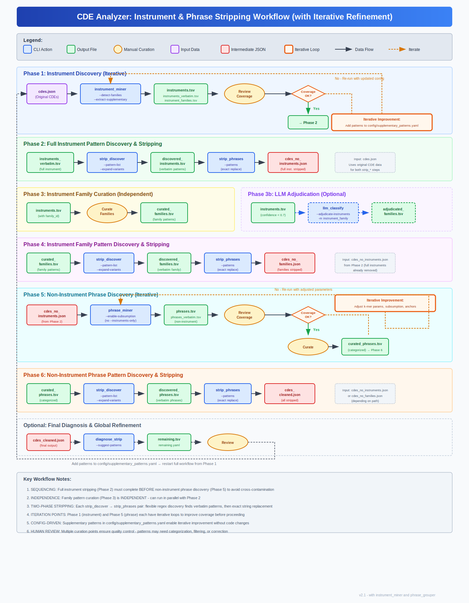

# Instrument & Phrase Stripping Workflow

This document describes the complete multi-phase workflow for extracting, curating, and stripping instruments and phrases from CDE text fields, including iterative refinement loops.



## Overview

The workflow consists of 6 main phases with **two iterative refinement loops** plus an optional global refinement at the end:

| Phase | Purpose | Iterative? | Key Output |
|-------|---------|------------|------------|
| 1 | Instrument Discovery | **Yes** | `instruments.tsv`, `instruments_verbatim.tsv` |
| 2 | Full Instrument Stripping | No | `cdes_no_instruments.json` |
| 3 | Instrument Family Curation | No | `curated_families.tsv` |
| 4 | Family Pattern Stripping | No | `cdes_no_families.json` |
| 5 | Non-Instrument Phrase Discovery | **Yes** | `curated_phrases.tsv` |
| 6 | Non-Instrument Phrase Stripping | No | `cdes_cleaned.json` |

**Critical sequencing**: Phase 2 (full instrument stripping) must complete BEFORE Phase 5 (non-instrument phrase discovery) to prevent instruments from contaminating phrase mining results.

---

## Phase 1: Instrument Discovery (Iterative)

Extract instrument patterns from CDE text using `instrument_miner` (dedicated action for instrument extraction). This phase includes an **iterative refinement loop** to improve coverage before proceeding.

### Initial Run

```bash
cde-analyzer instrument_miner \
    -i cdes.json \
    -o output/ \
    --extract-abbreviation-only \
    --extract-supplementary \
    --detect-families \
    --family-summary
```

### Outputs

| File | Description |
|------|-------------|
| `instruments.tsv` | All detected instruments with family assignments |
| `instruments_verbatim.tsv` | Verbatim surface forms for each instrument |
| `instrument_families.tsv` | Summary by instrument family (with `--family-summary`) |

### Iterative Refinement Loop

After each run, review coverage:

1. **Review output**: Check `instruments.tsv` for missing instruments
2. **Identify gaps**: Look for known instruments not detected
3. **Update config**: Add missing patterns to `config/supplementary_patterns.yaml`
4. **Re-run**: Execute `instrument_miner` again with updated config
5. **Repeat** until coverage is satisfactory

```yaml
# config/supplementary_patterns.yaml - example additions
- pattern: "Montreal Cognitive Assessment"
  name: "Montreal Cognitive Assessment"
  acronym: "MoCA"

- pattern: "Trail Making Test"
  name: "Trail Making Test"
  acronym: "TMT"
```

### When to Proceed

Move to Phase 2 when:
- Known instruments are detected
- False positive rate is acceptable
- Coverage improvements plateau

---

## Phase 2: Full Instrument Pattern Discovery & Stripping

Use the two-phase discover-first workflow to find verbatim occurrences and strip them.

### Step 2a: Discover Verbatim Patterns

```bash
cde-analyzer strip_discover \
    -i cdes.json \
    -m CDE \
    -o discovered_instruments.tsv \
    --pattern-list output/instruments_verbatim.tsv,full_match \
    --expand-variants \
    --discover-fails failed_instruments.tsv
```

### Step 2b: Strip Discovered Patterns

```bash
cde-analyzer strip_phrases \
    -i cdes.json \
    -m CDE \
    -o cdes_no_instruments.json \
    --patterns discovered_instruments.tsv \
    --trace-matching trace_instruments.tsv
```

### Key Concept: Discover-First Workflow

1. **strip_discover**: Uses flexible regex to find verbatim text variations
2. **strip_phrases**: Uses exact string replacement (no regex) for precision

This two-phase approach handles:
- Optional punctuation (hyphens, spaces)
- Case variations
- Abbreviations in parentheses

---

## Phase 3: Instrument Family Curation (Independent)

This phase runs **independently** of Phase 2 - can be done in parallel.

### Manual Curation

Review `instruments.tsv` and create `curated_families.tsv` containing:
- Family-level patterns (e.g., "Neuro-QOL" instead of full instrument names)
- Corrected family assignments
- New family patterns discovered during review

### Optional: LLM Adjudication

For instruments with `family_confidence < 0.7`:

```bash
cde-analyzer llm_classify \
    --adjudicate-instruments output/instruments.tsv \
    --adjudicate-threshold 0.7 \
    -m instrument_family \
    --providers claude openai \
    -o adjudicated/
```

### Output

`curated_families.tsv` - Family-level patterns ready for stripping

---

## Phase 4: Instrument Family Pattern Discovery & Stripping

Strip family-level patterns (shorter patterns like "PROMIS", "Neuro-QOL") from the instrument-stripped JSON.

### Step 4a: Discover Family Patterns

> **⚠️ WARNING: Do NOT use `--expand-variants` for family patterns.**
> Family names are short (e.g., "PROMIS", "Neuro-QOL") and variant expansion creates:
> - Massive numbers of pattern variants
> - Unresolvable ordering conflicts (short patterns contained in many others)
> - High false positive rates due to pattern brevity
>
> Use exact matching only for family-level patterns.

```bash
cde-analyzer strip_discover \
    -i cdes_no_instruments.json \
    -m CDE \
    -o discovered_families.tsv \
    --pattern-list curated_families.tsv,pattern
```

### Step 4b: Strip Family Patterns

```bash
cde-analyzer strip_phrases \
    -i cdes_no_instruments.json \
    -m CDE \
    -o cdes_no_families.json \
    --patterns discovered_families.tsv
```

### Why Separate Family Stripping?

- Full instrument names (Phase 2) are stripped first
- Family abbreviations may appear independently (not part of full name)
- Example: "PROMIS" alone vs "PROMIS Anxiety Short Form 8a"

---

## Phase 5: Non-Instrument Phrase Discovery (Iterative)

Run phrase mining on instrument-stripped text to find non-instrument repeated phrases. This phase includes an **iterative refinement loop** to optimize phrase extraction.

### Initial Run

```bash
cde-analyzer phrase_miner \
    -i cdes_no_instruments.json \
    -o output_phrases/ \
    --enable-subsumption \
    --enable-debruijn
```

**Note**: Input is `cdes_no_instruments.json` from Phase 2 - instruments already removed.

### Outputs

| File | Description |
|------|-------------|
| `phrases.tsv` | Detected phrases with frequencies |
| `phrases_verbatim.tsv` | Verbatim surface forms |

### Iterative Refinement Loop

After each run, review coverage and quality:

1. **Review output**: Check `phrases.tsv` for noise and gaps
2. **Adjust parameters**: Tune phrase_miner settings:
   - `--min-phrase-length` / `--max-phrase-length`
   - `--min-frequency`
   - `--enable-subsumption` / `--disable-subsumption`
   - `--enable-anchor` / `--disable-anchor`
   - `--enable-debruijn` / `--disable-debruijn`
3. **Re-run**: Execute `phrase_miner` again with adjusted parameters
4. **Repeat** until phrase quality is satisfactory

### Parameter Tuning Examples

```bash
# More aggressive subsumption (fewer redundant phrases)
cde-analyzer phrase_miner \
    -i cdes_no_instruments.json \
    -o output_phrases/ \
    --enable-subsumption \
    --subsumption-threshold 0.8

# Focus on longer phrases
cde-analyzer phrase_miner \
    -i cdes_no_instruments.json \
    -o output_phrases/ \
    --min-phrase-length 5 \
    --enable-anchor

# Higher frequency threshold (more common phrases only)
cde-analyzer phrase_miner \
    -i cdes_no_instruments.json \
    -o output_phrases/ \
    --min-frequency 10
```

### When to Proceed

Move to curation when:
- Phrase quality is acceptable
- Noise level is manageable
- Important patterns are captured

### Optional: Phrase Family Analysis

Use `phrase_grouper` to analyze patterns in discovered phrases and identify families that share common prefixes, suffixes, or infixes:

```bash
cde-analyzer phrase_grouper \
    -i output_phrases/verbatim_phrases.tsv \
    -o phrase_families/ \
    --k-min 3 \
    --k-max 15
```

This helps identify:
- **Prefix families**: Phrases starting with the same words (e.g., "In the past 7 days...")
- **Suffix families**: Phrases ending with the same words
- **Infix families**: Phrases sharing internal patterns

Outputs: `families.tsv`, `phrase_assignments.tsv`, `family_members.tsv`

### Manual Curation

Review `phrases.tsv` and `phrases_verbatim.tsv`:
- Categorize phrases (some may be instrument-like patterns missed earlier)
- Filter out noise
- Group similar phrases (use `phrase_grouper` output to identify families)
- Flag phrases that should go back to Phase 1 (instrument patterns)

### Output

`curated_phrases.tsv` - Non-instrument phrases ready for stripping

---

## Phase 6: Non-Instrument Phrase Pattern Discovery & Stripping

Final stripping phase for non-instrument phrases.

### Step 6a: Discover Phrase Patterns

> **⚠️ NOTE on `--expand-variants`**: Only use variant expansion for longer, specific phrases.
> For short or generic phrases, variant expansion causes ordering conflicts and false positives.
> When in doubt, run `--analyze-conflicts` first to assess containment relationships.

```bash
cde-analyzer strip_discover \
    -i cdes_no_instruments.json \
    -m CDE \
    -o discovered_phrases.tsv \
    --pattern-list curated_phrases.tsv,pattern
```

### Step 6b: Strip Phrase Patterns

```bash
cde-analyzer strip_phrases \
    -i cdes_no_instruments.json \
    -m CDE \
    -o cdes_cleaned.json \
    --patterns discovered_phrases.tsv
```

### Output

`cdes_cleaned.json` - Final cleaned CDE data with all patterns stripped

---

## Optional: Final Diagnosis & Global Refinement

Use `diagnose_strip` to find remaining patterns and refine the entire workflow.

```bash
cde-analyzer diagnose_strip \
    -i cdes_cleaned.json \
    -m CDE \
    -o remaining.tsv \
    --original cdes.json \
    --suggest-patterns
```

### Outputs

| File | Description |
|------|-------------|
| `remaining.tsv` | Patterns still present after stripping |
| `remaining.yaml` | Suggested additions to supplementary config |

### Global Refinement Loop

1. Review `remaining.yaml`
2. Categorize remaining patterns:
   - **Instruments**: Add to `config/supplementary_patterns.yaml` → restart from Phase 1
   - **Phrases**: Add to phrase curation → restart from Phase 5
   - **Noise**: Ignore
3. Re-run entire workflow from appropriate phase

---

## Iterative Refinement Summary

The workflow has **three levels of iteration**:

| Level | Phase | What to Adjust | Config/Parameters |
|-------|-------|----------------|-------------------|
| **Instrument** | Phase 1 | Add missing instrument patterns | `config/supplementary_patterns.yaml` |
| **Phrase** | Phase 5 | Tune k-mer parameters, thresholds | CLI flags (`--min-frequency`, etc.) |
| **Global** | Final | Add patterns discovered post-stripping | Config or re-curation |

### Iteration Decision Tree

```
After Phase 1 output:
├── Missing instruments? → Add to config → Re-run Phase 1
└── Coverage OK? → Proceed to Phase 2

After Phase 5 output:
├── Too much noise? → Increase thresholds → Re-run Phase 5
├── Missing phrases? → Decrease thresholds → Re-run Phase 5
├── Found instruments? → Add to config → Restart from Phase 1
└── Quality OK? → Curate → Proceed to Phase 6

After Final output:
├── Remaining instruments? → Add to config → Restart from Phase 1
├── Remaining phrases? → Add to curation → Restart from Phase 5
└── Clean enough? → Done!
```

---

## Workflow Variations

### Minimal Workflow (Instruments Only)

Skip family and non-instrument phases:

```
Phase 1 (iterate) → Phase 2 → Done
```

### Full Workflow with Family Stripping

Include family-level pattern stripping:

```
Phase 1 (iterate) → Phase 2 → Phase 3 → Phase 4 → Phase 5 (iterate) → Phase 6
```

### Parallel Curation

Phases 2 and 3 can run in parallel since they have no dependencies:

```
Phase 1 ─┬─→ Phase 2 ─────────────────────────→ Phase 5 → Phase 6
         └─→ Phase 3 → Phase 4 (uses Phase 2 output)
```

---

## File Dependencies

```
cdes.json (original)
    │
    ├─[Phase 1 - ITERATE]──→ instruments.tsv, instruments_verbatim.tsv
    │       ↑                       │
    │       └── config/supplementary_patterns.yaml
    │                               │
    │                    ├─[Phase 2]──→ cdes_no_instruments.json
    │                    │                    │
    │                    │                    ├─[Phase 4]──→ cdes_no_families.json
    │                    │                    │
    │                    │                    └─[Phase 5 - ITERATE]──→ curated_phrases.tsv
    │                    │                           ↑                       │
    │                    │                           └── param tuning        │
    │                    │                                                   │
    │                    │                                        └─[Phase 6]──→ cdes_cleaned.json
    │                    │
    │                    └─[Phase 3]──→ curated_families.tsv
    │
    └─[diagnose_strip]──→ remaining.tsv (global refinement → restart workflow)
```

---

## Best Practices

1. **Iterate before proceeding**: Don't rush past Phase 1 or Phase 5 - coverage improvements compound
2. **Always use discover-first workflow**: `strip_discover` → `strip_phrases`
3. **Strip longer patterns first**: Full instruments before family abbreviations
4. **Review curation outputs**: Human review prevents stripping legitimate content
5. **Use `--trace-matching`**: Track what was stripped for debugging
6. **Keep supplementary patterns in config**: Version-controlled, curator-editable
7. **Document iteration decisions**: Note why patterns were added or parameters changed
8. **Avoid `--expand-variants` for short patterns**: Family names and abbreviations are too short for variant expansion - creates unresolvable ordering conflicts and false positives

---

## Related Documentation

- [instrument_miner command](../help/instrument_miner.md) - Dedicated instrument extraction
- [phrase_miner command](../help/phrase_miner.md) - General phrase mining
- [phrase_grouper command](../help/phrase_grouper.md) - Phrase family analysis
- [strip_discover command](../help/strip_discover.md) - Pattern discovery
- [strip_phrases command](../help/strip_phrases.md) - Pattern stripping
- [diagnose_strip command](../help/diagnose_strip.md) - Stripping diagnostics
- [llm_classify command](../llm/llm_classify.md) - LLM-based classification
