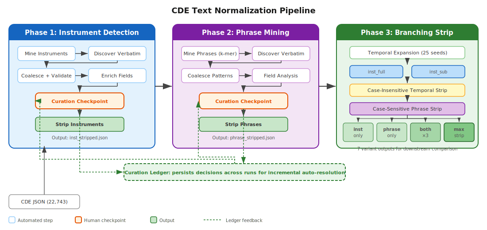
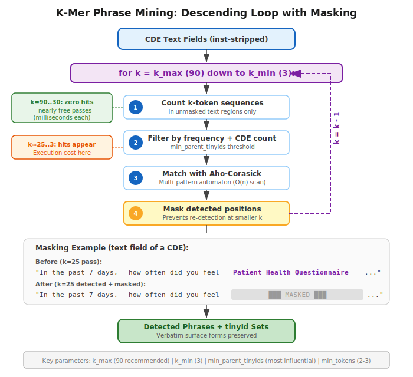
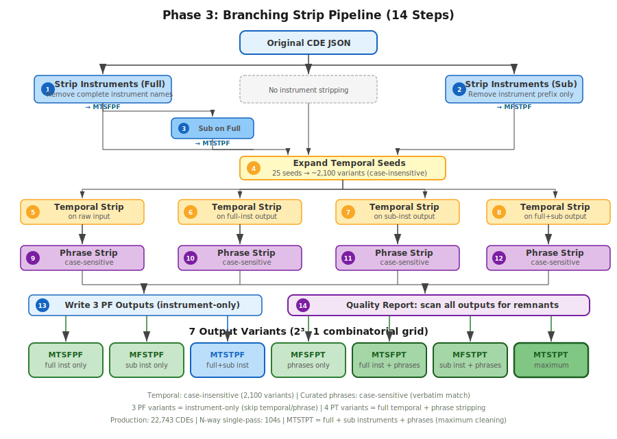
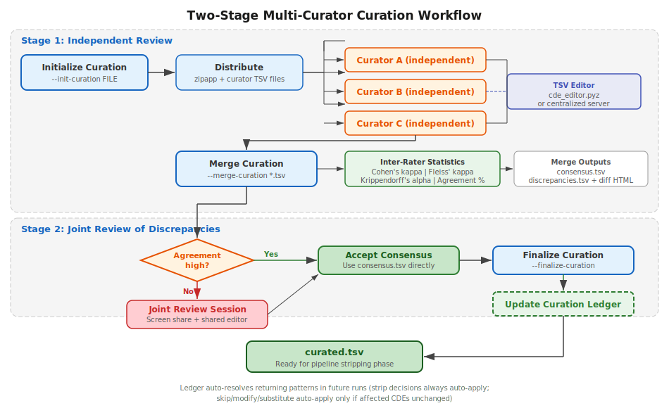

# CDE Text Normalization for Semantic Clustering

## Presentation Overview

CDE Analyzer: Automated detection and removal of repeated text patterns from NLM Common Data Elements to improve downstream embedding and clustering quality.

**Author**: Gerard Tromp
**Version**: 1.5.0
**Date**: March 2026

---

## 1. Project Intention

### Goal
Process CDE text fields for **semantic clustering** via transformer embeddings.

### Problem
Raw CDE text contains substantial **boilerplate noise** that distorts embedding space:
- CDEs sharing the same instrument cluster together regardless of clinical meaning
- Shared preambles ("In the past 7 days...") create false similarity
- Terse CDEs experience proportionally larger semantic drift

### Approach
A three-phase pipeline that **detects, curates, and strips** repeated text before embedding, producing multiple normalized variants for downstream comparison.

---

## 2. The Repeated Text Problem: Instruments

### Standardized assessment instruments appear across many CDEs

**Example** (before stripping):
> "This is a definition for Patient-Reported Outcomes Measurement Information System (PROMIS) Anxiety Short Form 8a item. In the past 7 days, I felt fearful."

The instrument name **"Patient-Reported Outcomes Measurement Information System (PROMIS) Anxiety Short Form 8a"** appears across dozens of CDEs in both definitions and designations.

### Scale of the problem (22,743 CDEs)
- ~1,300 instrument patterns mined
- 458 validated after curation
- Instrument stripping alone removes **515,000 characters**

### Variable surface forms
- "Patient Health Questionnaire-9 (PHQ-9)"
- "PHQ-9"
- "the PHQ - 9"
- "Patient Health Questionnaire"

---

## 3. The Repeated Text Problem: Boilerplate

### Recurring definitional and temporal preambles

**Temporal patterns**:
- "In the past 7 days"
- "Over the last 2 weeks"
- "During the past month"
- 25 seed patterns expand to ~2,100 variants

**Instructional boilerplate**:
- "Please respond to each item"
- "For each of the following statements"
- "Have you had any of the following"

### Combined impact (allcde03 — 22,743 CDEs)
| Stripping variant | Characters removed |
|---|---|
| Instruments only (full + sub) | ~515K |
| Phrases only | ~105K |
| All combined (MTSFPT) | **~553K** |

---

## 4. The Detection Challenge

### Why finding repeated text is hard

1. **Variable surface forms**: Same instrument appears with different punctuation, spacing, abbreviations
2. **Nested names**: "NIH Toolbox" vs "NIH Toolbox General Life Satisfaction" — both valid, different granularity
3. **Temporal variants**: "past 7 days" / "last seven days" / "the past week" — same semantic meaning, different text
4. **Case sensitivity**: Instrument names are case-sensitive (Title Case), but temporal patterns need case-insensitive matching
5. **Context dependence**: "Patient Health Questionnaire" in an instrument name vs. in a definition sentence

### Approach: Mine, Curate, Strip
Automated detection + human-in-the-loop curation + multi-variant stripping

---

## 5. Pipeline Overview



### Three phases with curation checkpoints

**Phase 1**: Instrument Detection — mine, discover, coalesce, validate, curate, strip
**Phase 2**: Phrase Mining — k-mer mining, discover, coalesce, field analysis, curate, strip
**Phase 3**: Branching Strip — 7 output variants for downstream comparison (field-aware splits)

### Key design features
- **Curation ledger** persists human decisions across runs
- **Incremental auto-resolution**: returning patterns skip human review
- **Zipf triage**: separate domain-specific from common English phrases

---

## 6. Key Aspects: Cyclical Improvement

### The Curation Ledger enables compounding efficiency

| Run | Patterns found | Auto-resolved | Need review | Curator effort |
|-----|:-:|:-:|:-:|---|
| Run 1 (first time) | 1,480 | 0 | 1,480 | Full review |
| Run 2 (expanded data) | 1,550 | ~900 | ~650 | 57% reduction |
| Run 3 (further expanded) | 1,480 | ~1,200 | ~280 | 81% reduction |

### How it works
- **strip** decisions always auto-apply (pattern recognized = valid)
- **skip/modify/substitute** auto-apply only if affected CDEs unchanged
- New tinyIds (CDEs) trigger re-review for non-strip decisions

### Zipf-based priority triage (v0.9.0)
- **High-priority** (any domain-specific word, Zipf < 4.0): multi-reviewer queue
- **Low-priority** (all common English, Zipf >= 4.0): fast single-reviewer triage
- allcde03: 1,480 patterns split to 582 high + 898 low

---

## 7. Phase 1: Instrument Detection

### Pipeline steps
1. **Mine instruments**: Title Case patterns, abbreviation detection, supplementary config
2. **Discover abbreviations**: Expand acronym forms (PHQ -> full names)
3. **Discover verbatim**: Find all surface-form variants in CDE text
4. **Coalesce**: Prefix-trie subsumption + NP-continuity (preserve sub-domains)
5. **Validate subsumption**: Empirical verification against actual text
6. **Enrich fields**: Add definition/designation counts
7. **Curation gate**: Auto-resolve from ledger or present new patterns
8. **Human curation**: Strip / Skip / Modify / Substitute decisions
9. **Strip**: Remove curated patterns from text

### Key parameters
- `min_prefix_tinyids`: 2 (how many CDEs must share a prefix pattern)
- `min_count` (iterative harvesting): `max(round(N * 0.0005), 5)`
- Iterative harvesting catches residual patterns across multiple rounds

### Results (22,743 CDEs)
1,342 raw -> 591 coalesced -> 458 validated instrument patterns

---

## 8. Phase 2: Phrase Mining

### Pipeline steps
1. **Mine phrases**: K-mer descending loop (k_max -> k_min)
2. **Discover verbatim**: Track surface forms + parent CDEs
3. **Coalesce patterns**: Subsumption filtering with `min_parent_tinyids`
4. **Field analysis**: Filter by `min_field_count`, `min_tokens`; identify dedup candidates
5. **Curation gate**: Auto-resolve from ledger
6. **Human curation**: Pattern-by-pattern decisions
7. **Strip phrases**: Remove curated patterns from text
8. **Discovery report**: Summary of findings

### Key parameters
- **`min_parent_tinyids`**: Highest impact (20->5 = 18.6x more patterns)
- **`min_field_count`**: High impact (6->3 = ~25% more patterns)
- **`k_max`**: 90 recommended (high-k passes with 0 hits are free)
- **`min_tokens`**: 2 admits bigrams; 3 is standard

---

## 9. Phase 2: K-Mer Mining Algorithm



### Descending loop with masking
For each k from k_max (90) down to k_min (3):
1. **Count** all k-token sequences in unmasked regions
2. **Filter** by frequency threshold and CDE count
3. **Match** using Aho-Corasick automaton (O(n) multi-pattern scan)
4. **Mask** detected positions to prevent re-detection

### Why descending order matters
- Longest phrases detected first -> shorter sub-phrases automatically excluded
- Masking prevents double-counting of overlapping patterns
- High-k passes (k=90..30) with zero hits complete in milliseconds

### Verbatim recovery
Original surface forms tracked before normalization — "Patient Health Questionnaire-9 (PHQ-9)" and "PHQ-9" both preserved as distinct variants

---

## 10. Temporal Detection

### 25 seed patterns expand to ~2,100 variants

**Seed examples**:
- "in the past [N] [UNIT]"
- "over the [past/last] [N] [UNIT]"
- "during [article] [N] [UNIT]"

**Expansion generates**:
- Numbers: 1, 2, 3, 4, 5, 6, 7, 8, 10, 12, 14, 24, 30, 48, 90
- Units: days, weeks, months, years, hours
- Bare forms: "Past 7 days"
- Article-only: "The past 7 days"

### Critical design decision
- Temporal patterns stripped **case-insensitively** (first pass)
- Curated phrases stripped **case-sensitively** (second pass)
- Prevents false matches from case-insensitive phrase stripping

### Result: 0 temporal remnants in definition/designation fields

---

## 11. Phase 3: Branching Strip



### Field-aware splits (v0.9.8+)

`inst_full` and `inst_sub` operate on **different text spans**:
- **inst_full** matches the group prefix (e.g., `PROMIS`)
- **inst_sub** matches the separator + suffix (e.g., ` - Anxiety`)

This makes all 7 variants genuinely distinct. Sub-patterns are group-scoped
during re-matching to prevent cross-instrument contamination.

### N-way single-pass engine

**N-way** (`branching_strip_nway.yaml`): 3 steps — loads CDE JSON once, produces all 7 variants simultaneously

| Stage | Operation | Case sensitivity |
|-------|-----------|:---:|
| `inst_full` | Group prefix removal | Verbatim |
| `inst_sub` | Separator + suffix removal | Verbatim |
| `temporal` | Temporal seed expansion + strip | Case-insensitive |
| `phrase` | Curated phrase strip | Case-sensitive |

### 7 output variants

| Code | Main inst | Sub inst | Phrases | Description |
|------|:-:|:-:|:-:|---|
| MTSFPF | Stripped | - | - | Full instrument prefix removed |
| MFSTPF | - | Stripped | - | Sub-instrument suffix removed |
| MTSTPF | Stripped | Stripped | - | Both instrument components removed |
| MFSFPT | - | - | Stripped | Phrases only |
| MTSFPT | Stripped | - | Stripped | Full instrument + phrases |
| MFSTPT | - | Stripped | Stripped | Sub instrument + phrases |
| MTSTPT | Stripped | Stripped | Stripped | All removed |

---

## 12. Production Results (allcde03 — 22,743 CDEs)

### N-way single-pass execution
- **Engine**: `strip_branching` via `branching_strip_nway.yaml`
- **Runtime**: **104 seconds** for 22,743 CDEs × 7 variants
- **Pattern inventory**: 383 inst_full + 252 inst_sub + 273 curated phrases + 7 substitutes + 39 verbatim + 2,100 temporal

### Quality metrics
- **Field retention**: 84.2% of fields at 90-100% retention (MTSFPT)
- **Temporal remnants**: 0 in PT variants (confirms temporal stripping works)
- **Non-temporal remnants**: 6 trailing_article remnants per variant (same 6 CDEs)
- **Hollowed-out CDEs**: 33 (0.1%) — all designation-only with pure boilerplate content

### Residue analysis (MTSFPT — maximum strip)

| Retention Band | % of Fields |
|---------------|------------:|
| 90-100% | 84.2% |
| 100% (unchanged) | 78.2% |
| 50-89% | 10.1% |
| 10-49% | 4.2% |
| 1-9% | 1.2% |
| 0% (empty) | 0.3% |

---

## 13. Parameter Comparison: allcde01 / allcde02 / allcde03

### Same corpus (22,743 CDEs), different parameter settings

| Parameter | allcde01 (strict) | allcde03 (midway) | allcde02 (lax) |
|-----------|:-:|:-:|:-:|
| `min_parent_tinyids` | 20 | **5** | 5 |
| `min_field_count` | 6 | **4** | 3 |
| `min_tokens` | 3 | **2** | 2 |
| `k_max` | 25 | **90** | 90 |
| Coalesced patterns | 138 | 2,132 | 2,132 |
| **After field analysis** | **86** | **1,480** | **1,599** |
| Zipf high-priority | - | 582 | - |
| Zipf low-priority | - | 898 | - |

### Impact ranking
1. **`min_parent_tinyids`** — HIGHEST (18.6x change)
2. **`min_field_count`** — HIGH (~25% swing)
3. **`k_max`** — MODERATE (free at high k)
4. **`min_tokens`** — LOW-MODERATE
5. **`k_min`** — NEGLIGIBLE

---

## 14. False Positive / False Negative Tradeoff

### Curator time is the bottleneck

| Setting style | Curator queue | False positives | False negatives |
|---|:-:|:-:|:-:|
| Strict (allcde01) | ~86 | Very few | Many missed |
| **Lax + Zipf (allcde03)** | **582 high + 898 low** | **Controlled** | **Very few** |
| Lax (allcde02) | ~1,599 | Many | Very few |

### Recommended approach
Use **permissive settings** (fewer false negatives) and manage the queue with:
- `--split-priority`: separate domain-specific from common phrases
- `--split-auto-skip`: pre-fill skip decisions for low-priority
- Curation ledger auto-resolves returning patterns

### Heuristic for `min_parent_tinyids`
```
min_parent_tinyids ~ max(2, N / 1000)
```
| CDEs | Suggested |
|------|:-:|
| 1,000 | 2 |
| 5,000 | 5 |
| 10,000 | 10 |
| 20,000 | 10-20 |

---

## 15. Two-Stage Curation Concept



### Stage 1: Independent Review
- Each curator receives their own copy of the pattern file
- Reviews independently using the TSV editor
- Assigns decisions: **strip** / **skip** / **modify** / **substitute**

### Stage 2: Joint Review of Discrepancies
- Merge produces inter-rater statistics (Cohen's kappa, Krippendorff's alpha)
- If agreement is high: accept consensus directly
- If disagreements exist: joint review session on discrepancies only
- Result: consensus decisions + updated curation ledger

---

## 16. Curation Workflow Detail

### Initialize and distribute
```
--init-curation enriched.tsv --curators "alice,bob,carol"
```
Creates per-curator TSV files with decision/modification/notes columns

### Curate independently
Each curator uses:
- **Standalone editor**: `python cde_editor.pyz curator_file.tsv` (zipapp, ~59 KB)
- **Centralized server**: HMAC token-authenticated web interface

### Merge and measure
```
--merge-curation curation_round/*.tsv -o results/
```
Outputs: consensus.tsv, discrepancies.tsv, inter_rater_report.md, discrepancies.html

### Inter-rater statistics
| Metric | Threshold | Interpretation |
|--------|:-:|---|
| Cohen's kappa (pairwise) | > 0.80 | Excellent agreement |
| Krippendorff's alpha (overall) | > 0.80 | Reliable |
| | 0.67-0.80 | Tentatively acceptable |
| | < 0.67 | Unreliable — needs discussion |

---

## 17. TSV Editor: Motivation

### Why a custom editor?

**Problem 1: Data corruption by common tools**
- Excel auto-converts tinyIds to dates or numbers
- Excel strips leading zeros, changes encoding
- Google Sheets reformats TSV columns unpredictably

**Problem 2: Restricted vocabulary**
- Curation decisions must be exactly: `strip`, `skip`, `modify`, `substitute`
- Free-text entry invites typos and inconsistency
- Need dropdown constraints on decision column

**Problem 3: Efficiency at scale**
- 1,480 patterns require batch operations, not row-by-row editing
- Need keyboard shortcuts for rapid decision assignment
- Need filtering to focus on subsets (e.g., "show only undecided rows")

### Solution
Browser-based TSV editor distributed as a Python zipapp (~59 KB, zero dependencies)

---

## 18. TSV Editor Features

### Decision assignment
- **Keyboard shortcuts**: S (strip), K (skip), M (modify), U (substitute)
- **Color-coded badges**: Green (strip), Red (skip), Orange (modify), Cyan (substitute)
- **Dropdown constraint**: Only valid decisions accepted

### Filtering and navigation
- **Column filters**: Text search, numeric operators (=, !=, >=, <=)
- **Decision filter**: Dropdown to show only strip/skip/modify/substitute/empty
- **Clear all filters**: Ctrl+Shift+F
- **Field profile colors**: Blue (definition), Orange (designation), Green (both), Purple (mixed)

### Batch operations
- **Group propagation**: Apply modifications across related patterns
- **Selection-aware**: Operates on selected rows or all if none selected
- **Undo/redo**: Full history with Ctrl+Z / Ctrl+Shift+Z

### Zipf pre-fill (v0.9.0)
- `--split-auto-skip` pre-fills `decision=skip` for low-priority patterns
- Reviewer only needs to override exceptions

---

## 19. TSV Editor Interface

### Layout
```
+----------------------------------------------------------+
| [Open] [Save] [Add] [Del]  |  [S] [K] [M] [U]  | [Clear|
+----------------------------------------------------------+
| Filter row: [pattern___] [tinyIds___] [decision v] [___] |
+----------------------------------------------------------+
| [ ] | pattern              | tinyIds  | decision | notes  |
|-----|----------------------|----------|----------|--------|
| [x] | Patient Health Qu... | 12 tinyI | strip    |        |
| [ ] | In the past 7 da... | 89 tinyI | skip     |        |
| [x] | Please respond t... | 45 tinyI |          |        |
+----------------------------------------------------------+
| 1,480 rows | 3 visible | 2 selected       | Saved [OK] |
+----------------------------------------------------------+
```

### Key UI elements
- **Toolbar** (42px): File ops, row ops, decision quick-buttons
- **Filter row**: Per-column filters with active indicator (orange background)
- **Data grid**: Sortable columns, inline editing, checkbox selection
- **Status bar**: Row counts, selection count, save status
- **tinyId pills**: Expandable/collapsible per row (click to toggle)

---

## 20. Additional TSV Editing

### Merge and Split operations

**Not used for curation** — but useful for pattern file management:

**Merge patterns** (`--merge-patterns`):
- Combine/deduplicate pattern TSV files from different sources
- Handles conflicting columns gracefully
- Extracts columns by header name (not position)

**Split operations**:
- `--split-priority`: Zipf-based priority triage
- Field-profile-based splitting: separate definition-only vs designation-only patterns
- Dedup pre-pass identifies whole-text duplicates exceeding k_max

### Pattern utility commands
```
cde-analyzer pattern_util --coalesce-variants FILE -o OUT
cde-analyzer pattern_util --merge-patterns FILE FILE -o OUT
cde-analyzer pattern_util --field-analysis FILE --input JSON -o OUT
cde-analyzer pattern_util --validate-subsumption FILE --input JSON -o OUT
cde-analyzer pattern_util --expand-temporal-seeds -o OUT
cde-analyzer pattern_util --split-priority FILE [--split-auto-skip]
```

---

## 21. Project Summary

### What's complete
- **Three-phase pipeline**: Instrument detection, phrase mining, branching strip
- **Curation infrastructure**: Multi-curator, ledger, gate, standalone editor, centralized server
- **Production-tested**: 22,743 CDEs × 7 variants in 104s, 0 temporal remnants, 0 stripping artifacts
- **N-way single-pass engine**: All 7 variants produced simultaneously with field-aware splits
- **Documentation**: 8 vignettes, 28 command reference pages, MkDocs site

### What remains
- **LLM-assisted classification**: Automated curation decisions using multi-LLM framework
- **Position-specific field-aware stripping**: Strip patterns only from specific field types
- **Embedding evaluation**: Run extract_embed on 5 branching-strip outputs to assess clustering quality improvement

### Version history highlights
| Version | Feature |
|---------|---------|
| v0.6.0 | Multi-curator curation, workflow scaffold, 7 vignettes |
| v0.7.0 | Standalone editor zipapp, centralized curation server |
| v0.8.0 | Incremental curation ledger and gate |
| v0.8.1 | Substitute decision type (4th curation decision) |
| v0.9.0 | Zipf priority split, editor UX improvements |
| v0.9.2 | N-way single-pass branching strip engine |
| v0.9.4 | Deferred parent filter, anchor trim control |
| v0.9.5 | Containment tree view in TSV editor |
| v0.9.6 | 5-way branching strip, allcde03 production run |
| v0.9.8 | Field-aware splits, 7-way branching strip, group-scoped re-matching |

---

## 22. Key Takeaways

1. **Three-phase pipeline** with human-in-the-loop curation at each phase
2. **Descending k-mer mining** with masking prevents redundant detection
3. **Curation ledger** enables incremental improvement — effort compounds across runs
4. **Zipf triage** separates domain-specific patterns from common English for efficient review
5. **Seven stripped variants** for downstream comparison (field-aware splits make all combinations distinct)
6. **`min_parent_tinyids`** is the single most influential parameter (18.6x impact)
7. **Standalone editor** enables distributed curation without Excel data corruption

### Pipeline design principle
> Automate detection, curate decisions, persist knowledge, strip with variants.
